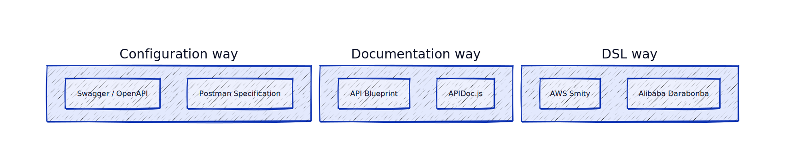
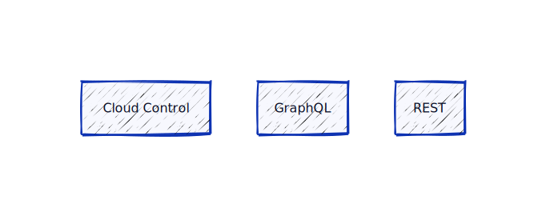

A001: API as Code Overview
----
* Author(s): @yufeiminds
* Approver: @yufeiminds 
* Status: Implemented
* Last updated: 2023-03-06
* Discussion at: #1

## Abstract

"X as Code" is a concept that has been widely used in the DevOps community. It means that the system's configuration is managed as code, and the system is managed by the code. In the Guance Cloud community, we have also been promoting the concept of "API as Code." This proposal introduces the "API as Code" concept and the related implementation plan.

In this proposal, we will describe a solution to manage all the API resources by the unified specification and provide a unified way to do the following things:

1. **Manage API resources as code**, such as API editing, API testing, etc.
2. **Generate artifacts from the specification**, such as API documentation, API SDK, API mock server, etc.
3. **Implement protocols**, such as Cloud Control, GraphQL, REST, etc.

## Background

API as Code is a concept that describes the management of API resources as code. The traditional way of managing API resources is to use the console or configuration files. The console is unsuitable for batch management and version control, and the configuration files are not easy to reuse and manage.

The above methods are all used to describe the API resources but must be unified. Different tools manage the API resources, and the API resources take work to reuse and manage.

For example, we must use different tools in traditional solutions to complete task. For example, we write the API in Yaml or DSL and the template in a general-purpose programming language from the DSL file's Abstract Syntax Tree (AST). Then we use the template to generate the API documentation and SDK. This is a highly complex process that can be challenging to maintain.

## Proposal

In this proposal, we describe a new solution to manage the API resources by the unified specification and provide a suitable way to do the following things:

1. We build the protocol compatibility layer on the resource management framework and provide a unified way to implement various protocols, such as Cloud Control, GraphQL, REST, etc.
2. We provide a unified code generator by the high-level configuration language CUE and generate artifacts from the specification, such as API documentation, API SDK, API mock server, etc.
3. We provide a unified way to manage API resources as code, such as API editing, API testing, etc.

### Resource Management Specification

Resource Management Specification is a specification that describes the resource name, title, description, attributes, and relationships of resources. It is a unified specification for all resources in the Guance Cloud community.

### Resource Management Server

Resource Management Server is a server that provides the resource management API. Its protocol compatibility layer can implement various protocols, such as Cloud Control, GraphQL, REST, etc.

### Resource Generator Framework

Resource Generator Framework is a framework that provides a unified way to generate artifacts from the specification, such as API documentation, API SDK, API mock server, etc.

This framework is based on the high-level configuration language CUE. It has some excellent features to help us create a unified code generator:

1. **Compile-time evaluation**: CUE can evaluate the value in compile time. So we can generate the code in compile time.
2. **Type-safe**: CUE has an excellent type system based on a fantastic lattice hierarchy. It can help us check the value type in compile time.
3. **Reuseable**: CUE has an excellent module system. We can reuse the code in different projects.
4. **Ecosystem Integration**: CUE has a great ecosystem. We can integrate the code generator with other tools like `go generate`, `make`, `mage`, `protoc`, etc.

## Rationale

### Swagger and OpenAPI

Swagger is faced with RESTFul API, which is unsuitable for other protocols, such as Cloud Control, GraphQL, etc. We need a unified solution to meet the resource management scene in this use case.

### Smithy and Darabonba

Smithy and Darabonba are DSL for API resources. But the code generator scene uses a general-purpose programming language to generate code from the DSL file's Abstract Syntax Tree (AST). It means the user must learn two languages, which requires much work.

## Implementation

### Repository Splitting

We split the repository into three parts:

1. **Iacker**, An open-source tool to compile the specification of API servers with various protocols, developer tools, and documentation.
2. **Generator**, The configuration repository to store the API resources specification of Guance Cloud.

For the details implementation plan, please refer to the proposal after this proposal.
