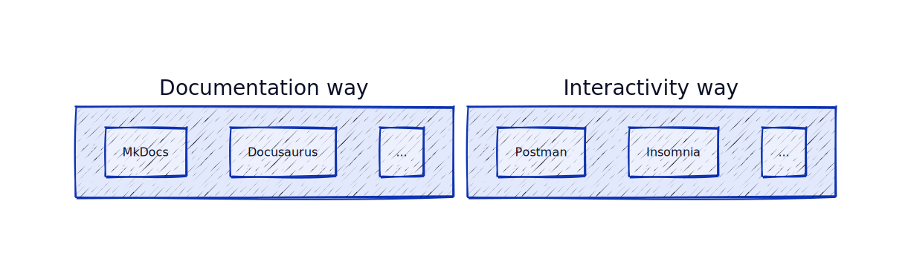
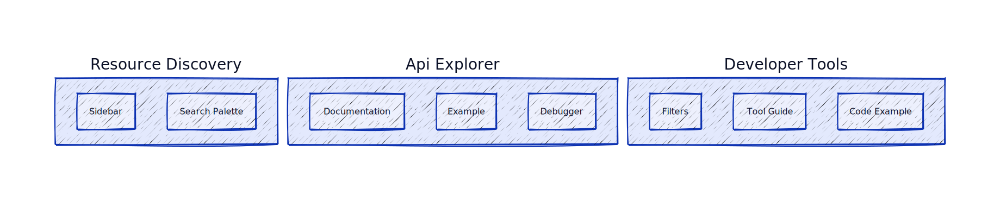

T001: Resource Explorer
----
* Author(s): @yufeiminds
* Approver: 
* Status: Draft
* Last updated: 2023-03-07
* Discussion at: #2

## Abstract

Resource explorer is a tool to help users explore RMS resources. It provides a unified way to do the following things:

1. **Discover the resources**. Provide a way to discover the resources from the RMS. Users can view, filter, and search the resources.
2. **Interact with the resources**. Users can use this tool to interact with the resources. For example, users can generate code examples for well-known tools such as Terraform, and CrossPlane, send the request to the API server, etc.
3. **Aggregate the information**. Users can discover the information of specified resources. Includes the related resources, documentation, examples, etc.

So this proposal builds a resource explorer to achieve that. It is a bridge between the RMS and the user, helping the user to improve the developer experience.

## Background

There have been some traditional ways to discover API resources in the past several years.

1. **Read the documentation**. Documentations are the first way to discover the resources. But finding the resources takes work. Users need to read the documentation carefully to find the resources. And the documentation takes work to maintain. It takes work to keep the documentation up-to-date.
2. **Use the API interactive tool**, such as Postman, Insomnia, etc. Users can use the API interactive tool to send requests to the API server. But most of them are focused on RESTFul API. We have many new architecture styles in modern API development, such as Cloud Control, GraphQL, etc. The API interactive tool is not easy to support these new architectural styles.

In addition, with the growing developer tool ecosystem, there are many new ways to interact with the resources, such as Terraform, Cossplane, etc. Some of them have declarative API, the user only needs to define the desired state of the resource, and the tool will help the user to reconcile the resource to the correct state. In this scene, the traditional way cannot support that good.

### Related Proposals

* [A001: API as Code Overview](./A001-api-as-code-overview.md). Describe the "API as Code" concept and the goals of this specification.
* [A002: Resource Management Specification](./A002-resource-management-specification.md). Describe the "API as Code" concept and the goals of this specification.
* [A003: Generator Framework](./A003-generator-framework.md). Describe how to generate the code from the resource management specification.

## Proposal

### Features

#### Discover the resources

The resource explorer provides two ways to discover the resources. 

* **Sidebar**. The sidebar provides a sidebar view of the resources. Users can click the sidebar to view the resources. There is also a special type of resource that is read-only. It is named Data Source. In the sidebar, we split it into two parts. Users can easily find them.
* **Search**. The search provides a search palette to search the resources. Users can search the resources by name, title, etc. The search result will be displayed by its category.

#### Aggregate the information

* **Related resources**. The resource explorer provides a way to discover the related resources. Users can view the related resources of the specified resource. The related resources are displayed as a graph with their relationship.
* **Documentations**. The resource explorer provides a way to discover the documentation of the resources. Users can view the documentation of the specified resource. The documentation is generated from the resource management specification.
* **Examples**. The resource explorer provides a way to discover examples of the resources. Users can view the examples of the specified resource. The examples are generated from the testing specification of RMS.

#### Interact with the resources.

* **Send request**. The resource explorer provides a way to send the request to the API server. Users can use the resource explorer to send the request to the API server. The resource explorer will help the user to generate the request body, and send the request to the API server. The response will be displayed in the resource explorer.
* **Run in Cloud**. The resource explorer provides a way to run the resource in the cloud. Users can run the example in the cloud with 1-click. It will help the user scratch the stack easily.
* **Generate code examples**. The resource explorer provides a way to generate code examples for well-known tools such as Terraform, CrossPlane, etc. Users can use the code examples to interact with the resources.

*Note: the debugger is working in progress. The PoC only includes the resource discovery and information aggregation part*

### Consistent Considering

The resource explorer is based on the resource management specification. So all the information of resources is generated by the RMS. We build a code generation pipeline to sync the resource explorer's RMS and frontend code. The code generation pipeline is based on the generator framework. It is a declarative way to generate the code. So the code generation pipeline is easy to maintain.

The resource explorer only provides a way to display the information. The resource explorer is a bridge between the RMS and the user. It helps the user to improve the developer experience.

### Internationalization

The resource explorer provides a way to support internationalization. Users can switch the language of the resource explorer.

Chinese simplified and English are the first two languages we support. We will support more languages in the future.

## Rationale

1. Why don't we use Swagger/Docusaurus/MkDocs UI?

Because the traditional way doesn't support the custom interactive method, we should follow the user's intention in the interaction. When the user changes the parameters, the resource explorer should compile the user's input into the code example of the well-known tools. And provide a mechanism to invoke the tool to reconcile the resource to the correct state. The data flow is a bit complex. We should build a non-text solution to support that.

## Implementation

Resource explorer is a web application. It is built with Next.js. It provides an SSG (Server Site Generation) way to build a react application as static files. So we can use Global CDN the delivery the site to edge nodes. Make users visit the site faster and SEO-friendly.

### Development Stack

* [Next.js](https://nextjs.org/). The React framework for production.
* [React](https://reactjs.org/). The JavaScript library for building user interfaces.
* [Tailwind CSS](https://tailwindcss.com/). A utility-first CSS framework for rapidly building custom designs.
* [Netlify](https://www.netlify.com/). The web application hosting platform.

### The Code Generation Pipeline

#### Typescript Interface

The typing interface is generated from the proto files.

There are two categories of types:

1. **The types of RMS**. Such as `Resource`, `Template`, `Manifest`, etc. This type is defined by the developer immediately. So we can generate the types from the proto files.
2. **The types of Resources**. This type is generated from the RMS. So we generate it from the RMS proto generator first. Then we generate the types from the generated proto files.

#### Debugger Form

We use the [react-jsonschema-form](https://github.com/rjsf-team/react-jsonschema-form) to generate the form automatically. The form is used for debugging the resource.

We build a CGP (Code Generation Pipeline) for the form. The CGP is based on the generator framework.

1. Build the Proto files from the RMS by the `proto` template.
2. Import the CUE definition from the Proto files.
3. Generate the JSON Schema files by CUE Tools.
4. Generate the form based on JSON Schema.

### More Details

For more details, please see the `site` folder in this project.
